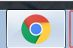

---
title: Using ImpressJS with Slidify
author: R Sian
mode: selfcontained
framework: impressjs
knit: slidify::knit2slides

--- .slide x:-1000 y:-1500

<link href='https://fonts.googleapis.com/css?family=Indie+Flower' rel='stylesheet' type='text/css'></link>

</head>

<q>1. </q>

--- .slide x:0 y:-1500

<q>2. </q>

 他帥 

--- .slide x:1000 y:-1500

<q>3. </q>
